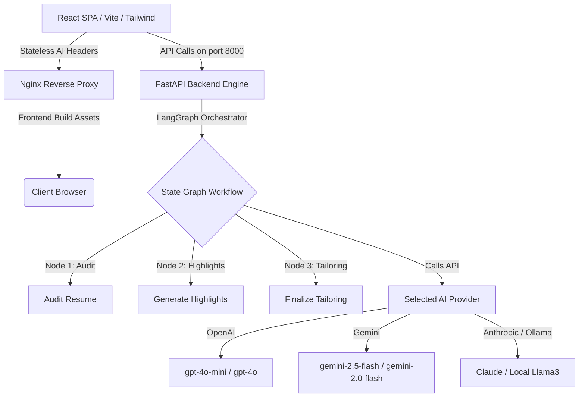

# ATS Shield AI: Resume Growth Lab

**ATS Shield AI** is a stateless, privacy-focused, provider-agnostic artificial intelligence platform built to parse resumes, audit ATS compatibility, optimize professional bullet points, and turn corporate job openings into custom tailored cover letters and interview prep assets in real-time.

Designed with a high-contrast boxy design and fluid layouts, it functions as a comprehensive offline-ready resume growth workspace.

---

## Key Capabilities

1. **AI ATS Resume Builder & Parser**:
   - Guided multi-field editor covering Personal Information, Summary, Experience, Core Skills, Projects, and Certifications.
   - **Upload Profile PDF**: Parse any PDF, Word (`.docx`), or TXT file using robust pyPDF & python-docx extraction agents to automatically populate fields.
   - **Interactive Blueprint Workspace**: Real-time render mockup modeled strictly on traditional single-column vector layouts with bold serif headings, pipe dividers, and aligned dates. Downloads scannable vector PDFs with 100% parsing success.

2. **ATS Scorer & Audit Panel**:
   - Paste any target job description and test matching keywords, readability scores, found strengths, critical fixes, and section score breakdowns.
   - **Direct Resume Audit Upload**: Upload a target resume file directly in the Scorer tab to instantly parse it and run the compatibility grading loop against the job requirements in one step.
   - **Interactive Highlights**: Discovers optimization suggestions on your blueprint. Click any highlighted segment inside the Builder to read the AI explanation and click "Apply Rewrite" to apply edits instantly.

3. **AI Provider Sandbox**:
   - Set stateless provider keys in the context where they are used (Builder/Scorer panels).
   - Supports **OpenAI (GPT-4o)**, **Anthropic (Claude 3.5)**, **Gemini (Flash/Pro)**, **OpenRouter (free models)**, and **Ollama (local Llama3 / Phi3 / Mistral)** running locally.
   - **Save & Fetch Official Models**: Fetch live available models for the selected provider in real-time.

4. **Discovery & Application Assistant**:
   - Match matched company listings fitting your profile or crawl live Lever / Greenhouse portals.
   - Craft customized, persuasion-focused cover letters linking projects directly to qualifications.
   - Generate behavioral STAR interview prep story guidelines and customized Q&As.

---

## Production Stack & Architecture



---

## Quick Start

### Method 1: Running inside Docker (Recommended)

1. Clone or download the directory.
2. Build and boot up the containers using Docker Compose:
   ```bash
   docker-compose up --build
   ```
3. Open your browser and navigate to:
   - **Frontend Dashboard**: `http://localhost`
   - **Backend OpenAPI docs**: `http://localhost:8000/docs`

### Method 2: Running Locally (Manual Setup)

#### 1. Setup Backend
```bash
cd backend
python3 -m venv venv
source venv/bin/activate
pip install -r requirements.txt
uvicorn app.main:app --host 0.0.0.0 --port 8000 --reload
```

#### 2. Setup Frontend
```bash
cd frontend
npm install
npm run dev
```
Open `http://localhost:5173` in your browser.

---

## Deployment & Releases (GitHub Actions)

This repository includes an automated GitHub Actions release workflow under `.github/workflows/docker-release.yml`. On pushing a version tag (e.g., `v1.0.0`), the workflow automatically:
1. Builds multi-stage production Docker containers for Nginx (Frontend) and FastAPI (Backend).
2. Publishes built packages to **GitHub Container Registry (GHCR)**.
3. Automatically generates and publishes a **GitHub Release Page** with a custom docker-compose deployment script.

### Running a Release Tag
You can deploy any tag immediately using this minimal `docker-compose.yml` (replace `<owner>` with your github organization or username):

```yaml
version: '3.8'

services:
  backend:
    image: ghcr.io/<owner>/ats-resume/backend:v1.0.0
    ports:
      - "8000:8000"
    restart: always

  frontend:
    image: ghcr.io/<owner>/ats-resume/frontend:v1.0.0
    ports:
      - "80:80"
    depends_on:
      - backend
    restart: always
```
Run `docker compose up -d` to deploy.
